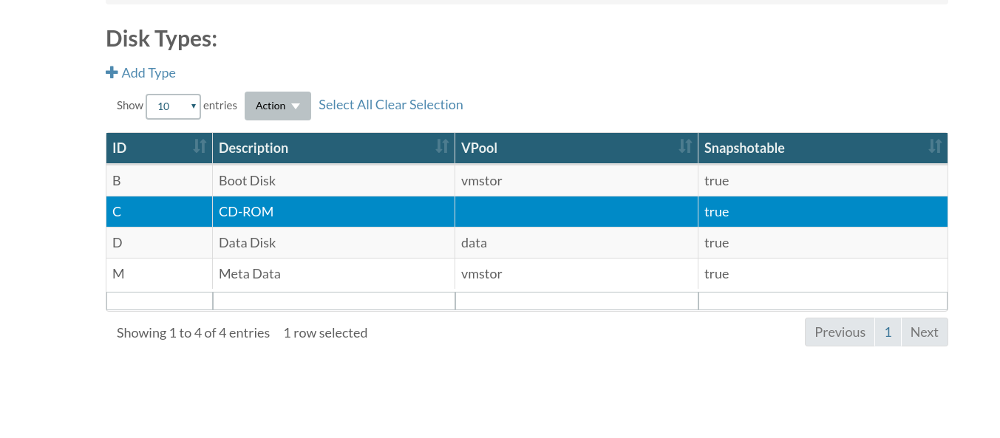
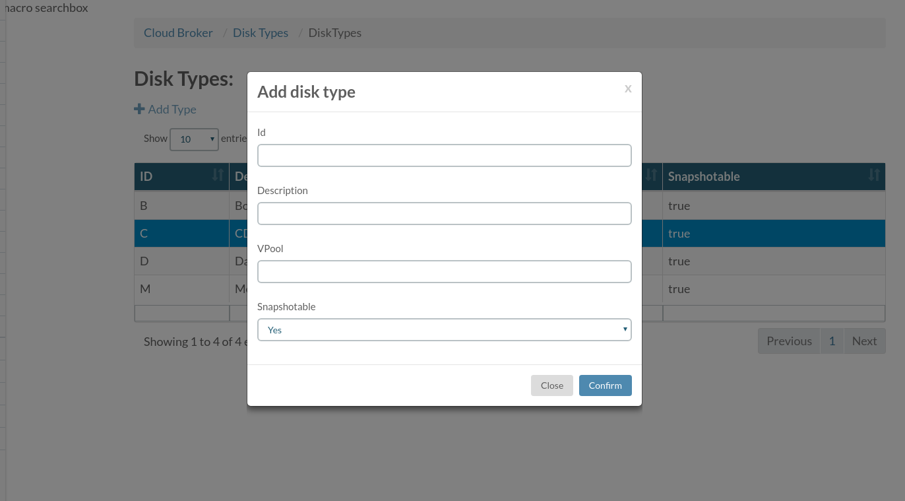
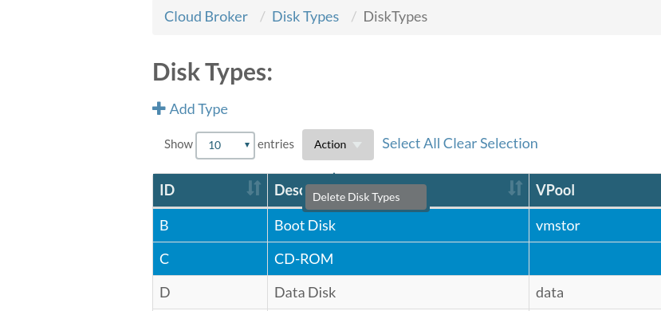

## Disk Types
The **Disk Types** page lists all Disk types

Clicking **+ Add Type** allows you to add a new disk type

Deleting can be done by selecting the types you want to delete and thenchoose button **Delete Disk Types**

