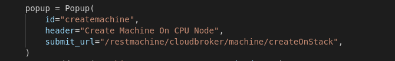
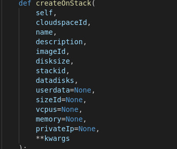
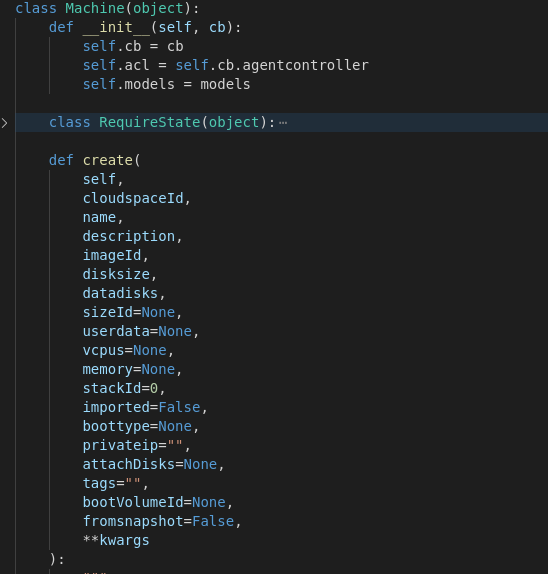

# Use cases

This is an illustration of typical use cases of the portal. 

### Create a VM 

The flow goes something as follows: 

1. The front end issues an API call to the cloudbroker api on this url: `/restmachine/cloudbroker/machine/createOnStack` 

   (can be seen in file: `openvcloud/apps/cbportal/base/CBGrid/.macros/page/createmachine/3_createmachine.py`)

   

2. This call is then picked by the actor `createOnStack` which is a function in the python module at `openvcloud/apps/cbportal/base/cloudbroker__machine/methodclass/cloudbroker_machine.py`

   

   When you look at `createOnStack()`, you'll see that this function calls the `cb.machine.create()` cloudbrokerlib api at file  

   `openvcloud/apps/cloudbroker/cloudbrokerlib/cloudbroker.py`

   

3.  `machine.create()` performs several checks and schedules another function `machine.reserve_resources()`

   

   where the several other checks are performed on the user input data and the actual reservation of resources happens.

4. If all parameters checkout at `reserve_resources()` we are now back at  `machine.create()` and specifically the last line in step 3 where we get the Id of the machine object that has been created and stored in mongodb. 

5. The machine state will now change to be DEPLOYING instead of VIRTUAL. **Note** that this idea of keeping states will be seen all over the code base. This is done so operations do not overlap in a way that's not supposed to happen for example trying to remove a machine while it's being deployed. 

6. `machine.create()` will then start the machine, and if needed, will attach the desks to it and finally return an Id of the machine object currently in the mongodb. Now on your portal if you wait a bit you'll see the machine created, briefly become DEPLOYING, then finally be RUNNING. 