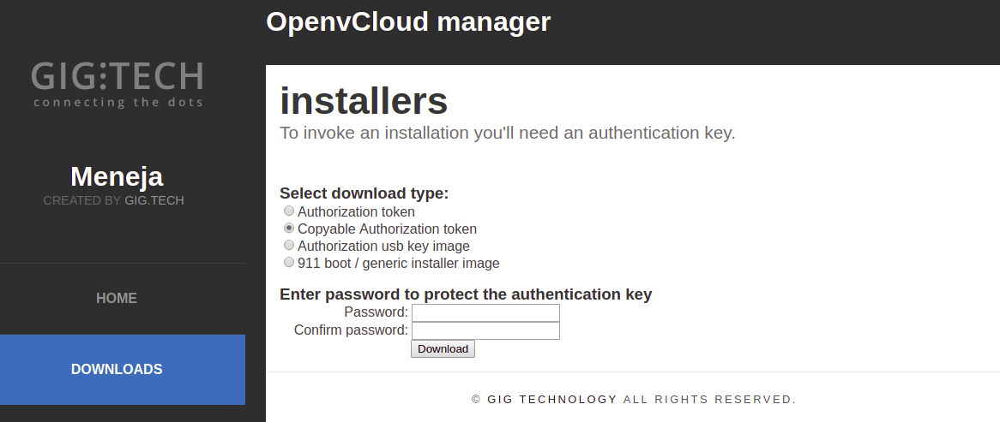
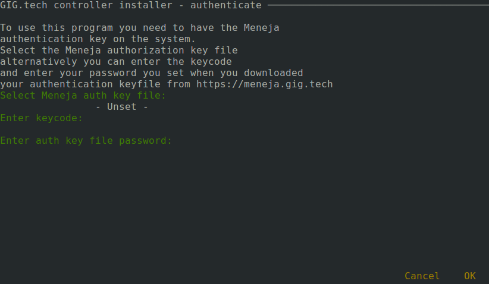
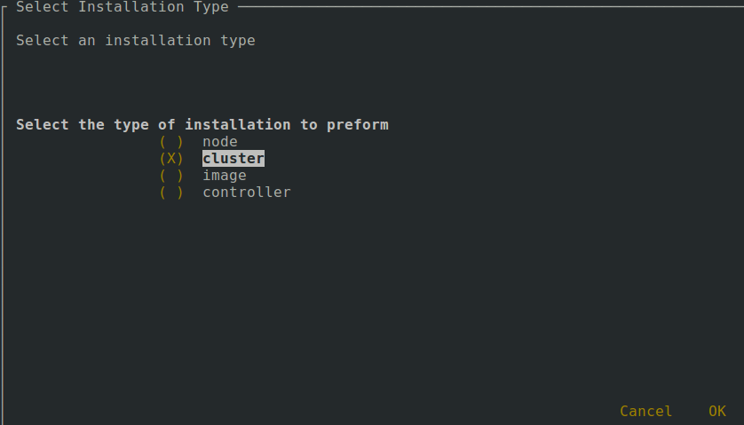

# OpenvCloud Cluster Setup

Setting up an OpenvCloud cluster is done in following steps:
- [Meet the prerequisites](#prerequisites)
- [Create the configuration file](#create-config)
- [Validate the configuration file](#validate-config)
- [Configure the switches](#configure-switches)
- [Install operation system on the controller nodes](#controller-os)
- [Setup the Kubernetes cluster and deploy the OpenvCloud system containers](#kubernetes-cluster)
- [Access the management container](#management-container)
- [Install the operating systems on the nodes](#os-nodes)
- [Setup the storage nodes](#storage-nodes)
- [Install JumpScale services on nodes](#jumpscale-nodes)
- [Deploy virtual machine images](#deploy-images)


<a id="prerequisites"></a>
## Meet the prerequisites

- Currently supported G8 size:
  - 3 dedicated controller nodes
  - 10 dedicated CPU nodes
  - 4 dedicated storage nodes
- SSH access credentials for all nodes
- Swap needs to be off on each node
- Each node needs to be able to access each other node in the cluster
- Certificates for SSL verification have to be included in YAML config in `certificates` section. Each certificate object should include fields `key` and `crt` containing a private key and a certificate correspondingly. The certificates for different cases should be referenced by name in `ssl` section
- `jsonschema` python library


<a id="create-config"></a>
## Create the configuration file

Installing an OpenvCloud cluster is done based on a single `system-config.yaml` configuration file.

This configuration files describes:
- Switch configuration
- Operating system installations
- Kubernetes cluster running on the controllers, which hosts the OpenvCloud master and and all other controller components
- CPU and storage nodes installation
- ...

The `system-config.yaml` file needs to be stored and maintained in the root of a Git repository on `https://docs.greenitglobe.com`; for each G8 installation there is distinct Git repository on https://docs.greenitglobe.com

The following rules apply:
- The name of the repository should be formatted `env_<<descriptive environment specification>>`, e.g. `env_be-g8-4`
- The repository needs to be put in an organization that represents the partner or customer, e.g. `gigtech` organization for G8s owned by GIG itself, or `digitalenergy` for our Russian partner

Some examples of repositories:
  - https://docs.greenitglobe.com/gigtech/env_be-g8-4
  - https://docs.greenitglobe.com/gigtech/env_se-sto-en01-001
  - https://docs.greenitglobe.com/digitalenergy/env_mr4

An example of a `system-config.yaml` can be found [here](system-config.yaml).

> **Important** A common technique to create a `system-config.yaml` is to make a copy from another environment and start editing. Please make sure to alter the `ssh.private-key` setting, and not just leave the copy from the other environment.


<a id="validate-config"></a>
## Validate the configuration file

Having valid configuration is of course very important. Validating is done with the OpenvCloud environment manager, a.k.a. **Meneja** (Swahili for 'manager'), available on https://meneja.gig.tech.

In [Meneja](https://meneja.gig.tech) you can select the environment you are setting up and click the **Validate configuration** button. When your configuration is valid you'll see the following text appear next to the button: **"The configuration is valid!"***


<a id="controller-os"></a>
## Install the operation system on the controller nodes

On [Meneja](https://meneja.gig.tech) a USB stick can be downloaded that already has the custom configuration for a specific environment. As shown on the screenshot below, there is a link called "Download usb installer image" which results in a bootable ISO file, which can be used to boot from (via the IPMI or via burning it onto a USB stick):


After booting up the controller node with the boot image, the user gets a screen with the following options:


The rest is extremely simple. Just select the right option depending on the controller node that needs to be installed and the rest is completely automatic.

Once you see the following screen, the installation of the controller node has finished. Just unplug the installer image and reboot the machine.


Repeat this procedure for all three controllers.

<a id="configure-switches"></a>
## Configure the switches
configuration of switch should be done like following
```
network:
  backplane:
    network: 10.107.1.0/24
  cisco:
    hostname: be-g8-3
    ports:
      controllers:
        ipmi: 1-3
        management: 4-6
      cpunodes:
        ipmi: 7-15
        management: 16-24
      mellanox: 33,34
      stornodes:
        ipmi: 25-28
        management: 29-32
    switch-ip:
      address: 10.107.2.201
      netmask: 255.255.255.0
    disabled-port-range: 5-11
    name: 50 port switch
    password: cisco
    username: cisco
    provider-port: 48 # uplink
    trunk-ports:
      controllers: 45-47
      mellanox: 49,50
  gateway-management:
    network: 10.199.0.0/22
    vlan: 2314
  ipmi:
    network: 10.107.4.0/24
    vlan: 2311
  management:
    gateway: 10.107.2.254
    network: 10.107.2.0/24
    vlan: 2311
  mellanox:
    - name: mellanox-1
      username: admin
      password: admin
      disabled-port-range: 1/12-1/16
      sw-uplinks: 
          cisco-mlx: 11
          mlx-mlx: 12
      storage-ports:
          split: no
          ports: 1-4
      cpu-ports:
          split: yes
          ports: 5-7
      mlag-ip: 122.21.21.12
      lacp-port-ranges: 1 - 16   # mlag port channel def 
      provider:
        port: 46
        vlan: 2300
        mlag-channel: 17
      switch-ip:
        address: 10.107.2.202
        netmask: 255.255.255.0

    - name: mellanox-2
      username: admin
      password: admin
      disabled-port-range: 1/12-1/16
      sw-uplinks: 
          cisco-mlx: 11
          mlx-mlx: 12
      storage-ports:
          split: no
          ports: 1-4
      cpu-ports:
          split: yes
          ports: 5-7
      mlag-ip: 122.21.21.12
      lacp-port-ranges: 1 - 16
      provider:
        port: 48
        vlan: 2300
        mlag-channel: 17
      switch-ip:
        address: 10.107.2.203
        netmask: 255.255.255.0
```


<a id="kubernetes-cluster"></a>
### Setup the Kubernetes cluster and deploy the OpenvCloud system containers

This will create a Kubernetes cluster and deploy all OpenvCloud system containers needed to manage an OpenvCloud cluster.

One of these containers is the management container, through which you will be able to check the status of all other containers;discussed next.

Open meneja and download the authorization token:



Save your token as `token`

To connect to the controller use [teleport](../Sysadmin/Connect/teleport.md).

Upload the authorization token:
At the bottom left press the "Upload files" button, then "Select files" to select your authorization token


For more details about the `ìnstaller` script see [Installer Script Details](Installer-script.md).

To begin the installation you need to first login to the docker registry that contains the needed install image.
This is done as follows:

```bash
docker login -u {username} {docker registry}
```

The above command will result in a prompt to enter the password of the specified account.

Run the following command to start the cluster installation:

```bash
docker run -it --rm -e ENV_OVC_VERSION={version} -v /tmp:/tmp {docker_registry}/ovcimages/openvcloud/management:{IMAGE VERSION}
```

> It is possible to specify the manifest url directly instead of the version:

```bash
docker run -it --rm -e OVC_VERSION_URL={manifest url} -v /tmp:/tmp {docker_registry}/ovcimages/openvcloud/management:{IMAGE VERSION}
```

This will result in the following prompt:



Use "Select Meneja auth key file:" to navigate to your token under `/tmp/token` and enter the password for that key. Select from the next menu the environment to be installed.  


Then choose `cluster deploy` to install the cluster.




<a id="management-container"></a>
## Access the management container

The management container is used to perform various admin operations on the environment. It is based on the management image and has the `kubectl` tool installed that is needed to perform various Kubernetes related operations. The management container also contains the environment system configuration which is necessary to use the `installer` tool inside the pod. The `installer` tool uses the system config by default and it doesn't need to be specified by the user.

For more details about the `ìnstaller` script see [Installer Script Details](Installer-script.md).

Accessing the management container can be done using **0-access**.

From a web browser open the OpenvCloud portal and go to the **0-access** page at `https://{env name}.demo.greenitglobe.com/cbgrid/0-access`.


Choose `management` from the list. You will be directed to a page that will allow you to request access to the pod which will redirect you to a page with instructions about how to access the management container and the remaining time for this session.

In the management container you can check the status of all pods using the following command:

```bash
kubectl get pods
```

If all pods are running continue to the next step.

<a id="os-nodes"></a>
## Installing the operating system on the nodes

You need to be in management container to perform this operation.

To prepare the CPU and storage nodes with the necessary OS, first start a tmux session and then run the following command:

```bash
installer node action --name all install_os
```

If a node fails during the installation, use the following command to install the node again:

```bash
installer node action --name {node name} install_os
```


<a id="storage-nodes"></a>
## Setup the storage nodes

From the management container execute:

```bash
export ENV_NAME="be-g8-3"
# let's generate the config
python3 /opt/code/git.gig.tech/openvcloud/openvcloud_installer/scripts/ovs/ovs_configurator.py

cd /opt/code/github/openvstorage/dev_ops/Ansible/openvstorage/playbooks/
ansible-playbook -i inventories/$ENV_NAME/inventory preInstall.yml
# this last step is not very bullet proof and might need to be repeated
ansible-playbook -i inventories/$ENV_NAME/inventory full_setup.yml
```

<a id="jumpscale-nodes"></a>
## Install JumpScale services on the OpenvCloud cluster nodes

You need to be in management container to perform this operation.

First start a tmux session. The following command will install the JumpScale services on all OpenvCloud cluster nodes (CPU and storage):

```bash
installer node jsaction --name all install
```

If a node fails during the installation, use the following command to install the node again:

```bash
installer node jsaction --name {node name} install
```

For more details about the `ìnstaller` tool see [Installer Script Details](Installer-script.md).

When done, the environment should be ready to use.

<a id="deploy-images"></a>
## Deploy virtual machine images

To add images [see](../CloudBrokerPortal/Images/Images.md)
