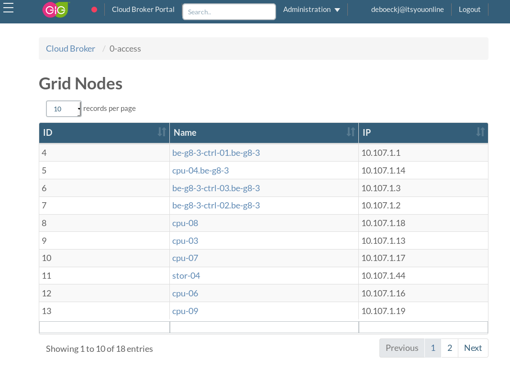

# 0-Access

0-Access is running as a pod part of the kubernetes cluster on the controllers.
Authentication through 0-Access is handled through OpenvCloud using the public keys configured in the user's itsyou.online profile.

We can see sessions per nodes by clicking on a node from this list.

The same page also allows starting a new session to this node.

