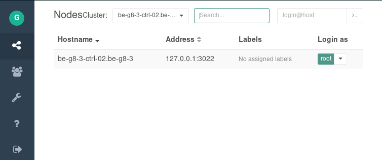

# Teleport

Our teleport is running on all our controllers and is installed during the instalation of the controller.
It runs as a systemd service and authenticates via github. See [system-config](../../Installation/System-config.md) for details about authentication.

Teleports runs under the root domain of the environment on port 3080. For example:

`https://myg8.mydomain.com:3080/`

After going to the teleport portal click the __Login with Github__ button.

Click on `root` to connect to the controller

