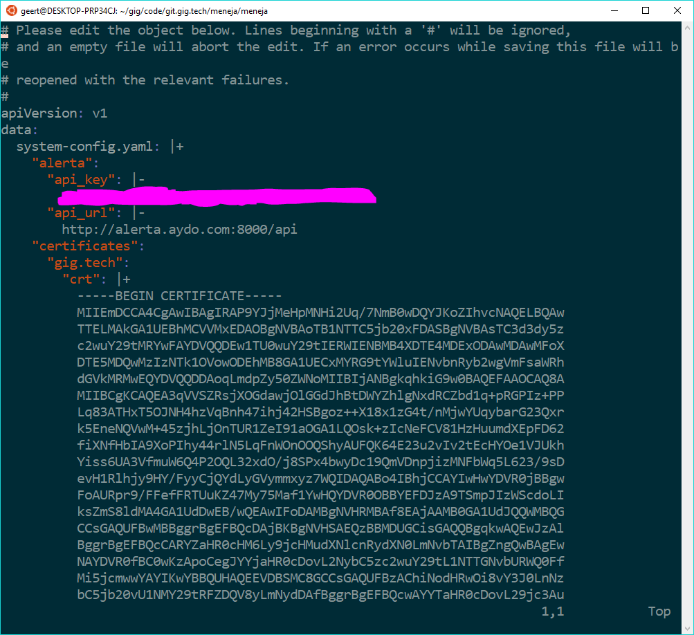

# Updating the ssl certificate of an OpenvCloud instance

## Editing the system-config
- Step 1: Connect to the management container via 0-access
- Step 2: Restore the kubectl environment variables via issueing the following command in the shell: `eval for x in $(cat /proc/1/environ | tr '\0' '\n' | grep -i kube); do echo "export $x"; done`
- Step 3: Export the system-config to a file through issueing the following command in the shell: `kubectl get configmap system-config -o jsonpath="{.data.system-config\.yaml}" > system-config.yaml`
- Step 4: Edit the system-config.yaml file to replace the SSl certificate and key in the **certificates** section and write the changes

## Applying the system-config
- Step 5: Import the system-config.yaml file containing the new SSL certificate and key into the system by issueing the following command in the shell: `installer --config system-config.yaml cluster resources`
- Step 6: Issue the following command to make the changes of the system-config take effect: `installer cluster updatedomain`

After completing this procedure the OpenvCloud instance will start serving https with the newly installed SSL certificate.

