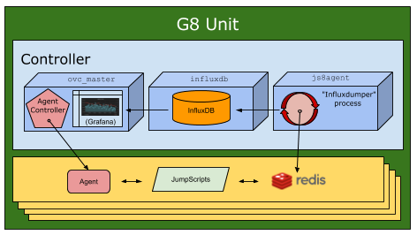

# Self-healing JumpScripts

The JumpScripts documented here implement the self-healing capabilities of a G8 environment by monitoring all components and taking appropriate actions.

On the physical machines (PM) self-healing agents are monitoring and storing the collected statistics in **Redis**. On the **G8 Controllers** all these statistics are aggregated in an **InfluxDB**. In the **Cloud Broker Portal**, running on **ovc_master**, **Grafana** is used to visualize this information.

Also see ../specs/categories.md

Auto-generated documentation:

* [Collectors Reality](collectors_reality/)
* [Collector Stats](collectors_stats/)
* [Health Checks](healthchecks/)
