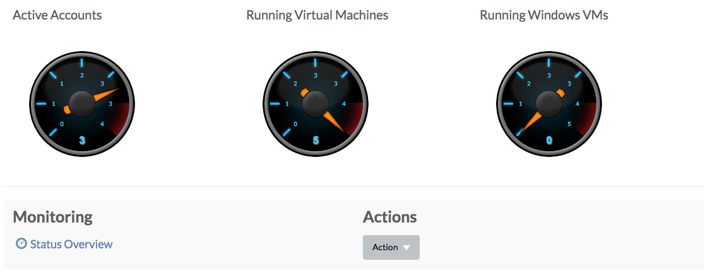
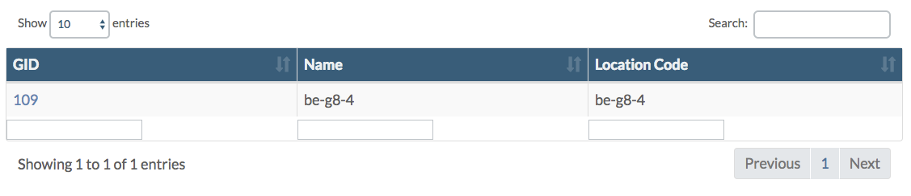

# Home

On the home page there are three sections:

* [Dashboard](home.md#dashboard)
* [Locations](home.md#locations)
* [Accounts](home.md#accounts)

## Dashboard 

Here three gauges report about the number of active accounts, the number of running virtual machines and the number of running virtual machines using Windows:

The **Actions** dropdown menu provides access to the frequently used actions **Add User** and **Add Account**:

Also a link to the [Status Overview](../gridportal/statusoverview.md) page is included.

## Locations 

Here all the locations are listed, linking to the **Location Details** pages:

## Accounts 

And finally all the accounts are listed, linking to the **Accounts Details** pages:

