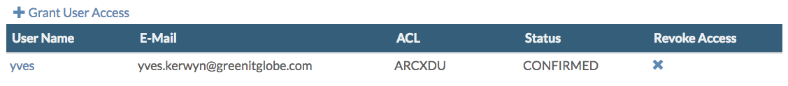
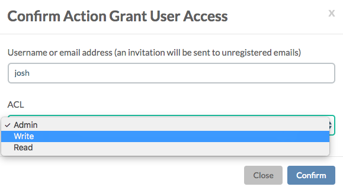
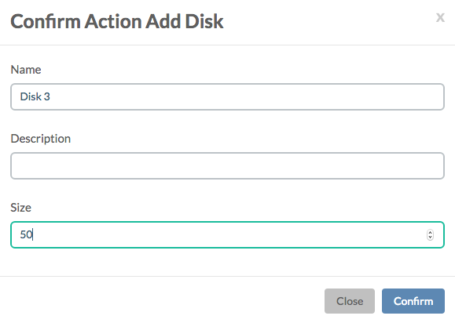
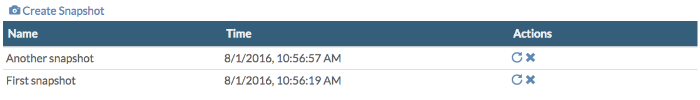
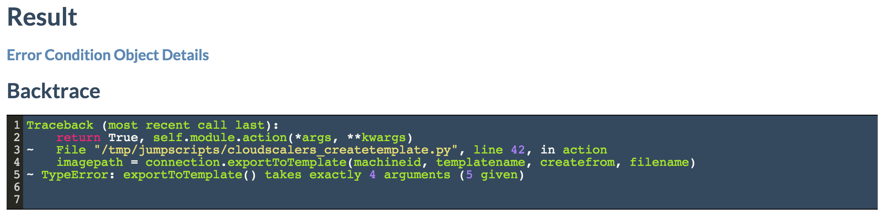

# Virtual Machines

On the **Virtual Machines** page all virtual machines are listed:

From here you can go to the **Virtual Machine Details** page for a virtual machine you select by its name.

From the **Actions** dropdown menu you can:

* Start, stop, reboot, pause, delete and clone a virtual machine
* Create a template from the virtual machine \(which are saved to `/mnt/vmstor/templates/`\)
* Update the virtual machine
* Check image chain
* [Move to another CPU node](movevm2anothercpunode.md)
* [Export VM](https://github.com/openvcloud/docs/tree/6e9bf0cd755ed9fcfd39b1e52ec5e2fbda4125cb/docs/CloudBrokerPortal/VirtualMachines/Actions/ExportVM.md)
* Add and remove tag

## Users Access

All users with access right for the virtual machine are listed here:

Clicking **+ Grant User Access** allows you to add users:

## NICs

This table lists the virtual network interface cards \(NIC\) in the virtual machine, showing the MAC addresses and IP address on the private network:

Clicking **+ Attach To External** allows you to attach the VM directory to the external network. Be aware that you will have to assign the IP address yourself in the operating system.

## Disks

In the **Disks** table all the virtual disks attached to the virtual machine are listed:

With the **+ Create Disks** link you can easily add disks:

## Snapshots

Here all the snapshots are listed:

Creating snapshots is straight forward, and rolling back or deleting a snapshot is done by clicking on one of the icons in the **Actions** column.

## Port Forwards

Here all port forwards are listed:

Adding more port forwards and removing existing ones is easy.

## Jobs

This table lists all jobs executed on the virtual machine, and the results:

When clicking on the time stamp, you'll see the **Job Details**:

Most interesting here is the **Result** section where you see a backtrack:

