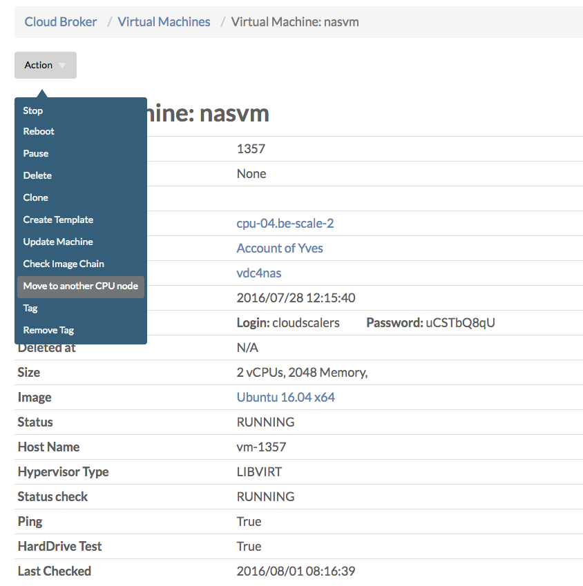
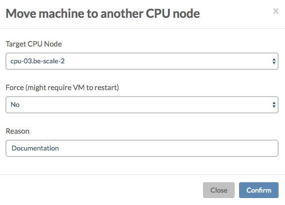
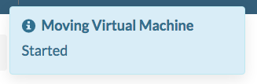
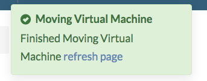

# Move to another CPU node

In order to move a virtual machine to another CPU node you choose **Move to another CPU node** from the **Actions** dropdown menu on the **Virtual Machine Details** page:

In the dialog that then appears you specify to which CPU node you wish to move:

This will schedule the **vm\_livemigrate** job as listed in the **Jobs** table at the bottom of the **Virtual Machined Details** page, as indicated by the messages that will appear in the top right corner of the portal:

Once finished, you will be invited with a new pop-up message to refresh the screen:

