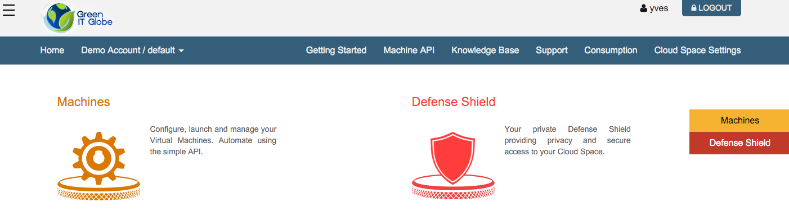
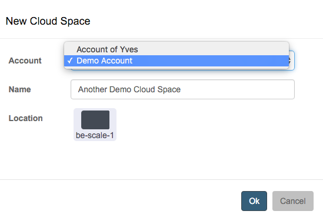
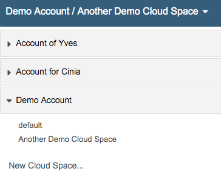

# Home

Once logged in a user to the End User Portal you will see the home page:

In this screenshot you can see in the top right corner that a user with username 'yves' is logged in.

In the top navigation bar, next to **Home** you choose the cloud space that you want to use. In the example shown here, the default cloud space of the account 'Demo Account' is selected.

When you click the dropdown arrow next to the selected cloud space a list appears showing all other accounts and cloud spaces the logged in user has access to:

In this example the logged in user has access to three accounts, and within the "Account of Yves" account to 2 distinct cloud spaces.

From this dropdown menu the user can also create a new cloud space:

In the **New Cloud Space** dialog window you have to indicate in which account you wish to create the new cloud space, give it a name and specify the location where the cloud space needs to be hosted.

Once the new cloud space got created, the new cloud space will be auto-selected in the top navigation bar:

Clicking again the dropdown arrow next to the selection, you can verify that the new cloud space has indeed been created in the specified account, here in the 'Demo Account':

Next you will want to read documentation about:

* [Cloud Space Settings](cloudspacesettings.md)
* [Virtual Machines](machines.md)
* [Defense Shield](defenseshield.md)
* [Machine API](machineapi.md)

