# Machines

The **Machines** page is where you create and manage virtual machines.

In order to be able to create a machine, you need to have access to a virtual datacenter.

Within the **End User Portal** you can discover to which virtual datacenters you have access by clicking the second link in the top menu bar.

In the below screenshot for example you can see that the logged in user has access to several datacenters, of which two of them created in the 'Account of Yves':

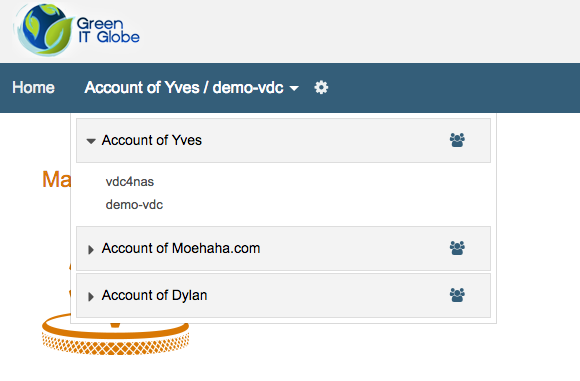

In order to have access to other virtual datacenters, or in order to create a new virtual datacenter, you will need to contact a user with administration rights to a cloud account.

Once you have selected a virtual datacenter, you can navigate to the **Machines** page for that virtual datacenter, by clicking the Machines icon or clicking Machines in the right navigation menu:

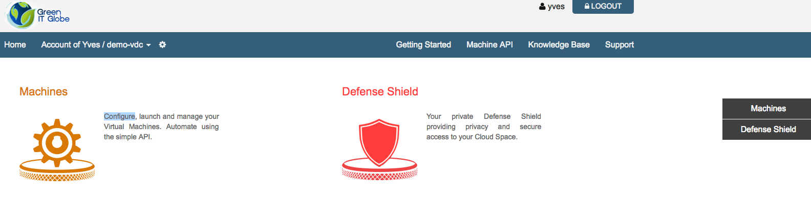

In the below screenshot you see that no virtual machines have been created yet in the **demo-vdc** virtual datacenter:

## Create a new Machine

Clicking **Create Machine** allows you to add a virtual machine to the virtual datacenter.

Give your machine a name:

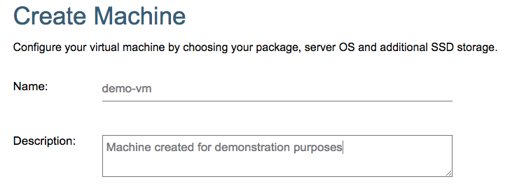

Select an o/s image:

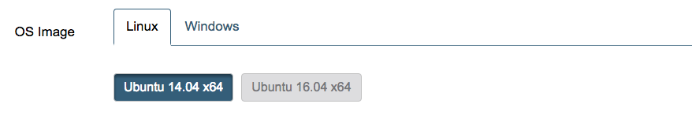

Choose one of the predefined machines packages:

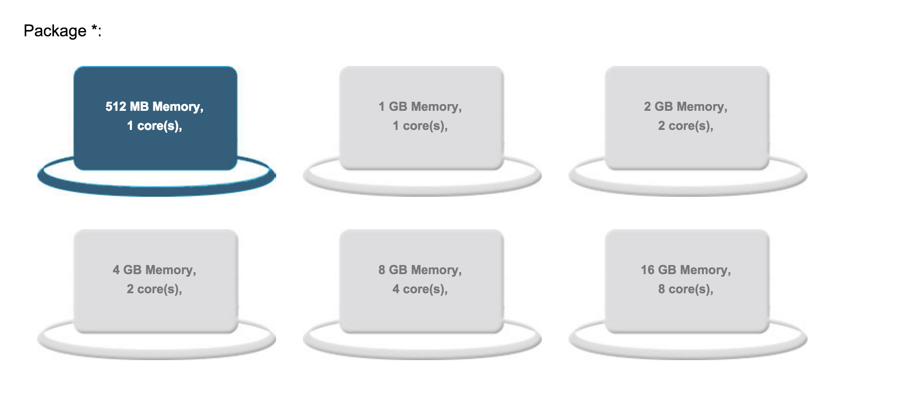

And finally select the size of the boot drive:

As a result you will see this:

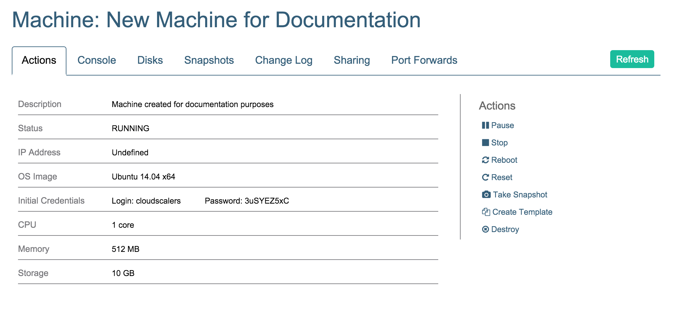

## Actions

The above screenshot shows the **Actions** tab of you newly created machine.

Here you can:

* **Pause**
* **Stop** and **Start**
* **Reboot**
* **Reset**
* **Take Snapshot**
* **Destroy**

## Console

From the **Console** tab you can login to your virtual machine:

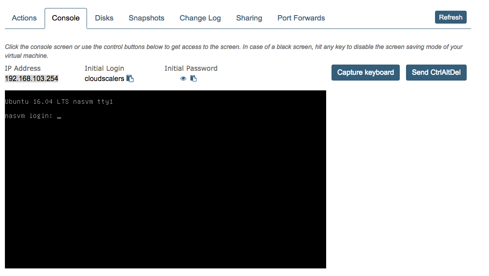

You will want to use the very handy paste buttons for the username and initial password.

## Disks

On the **Disks** tab you get add extra data storage to your virtual machine via the **Create disks** subtab:

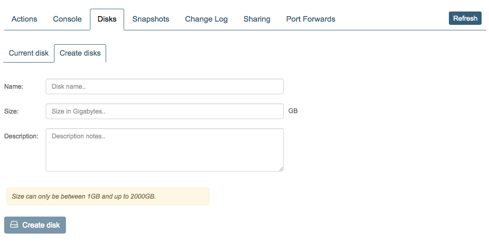

Below the result after having added two 50 GB disks:

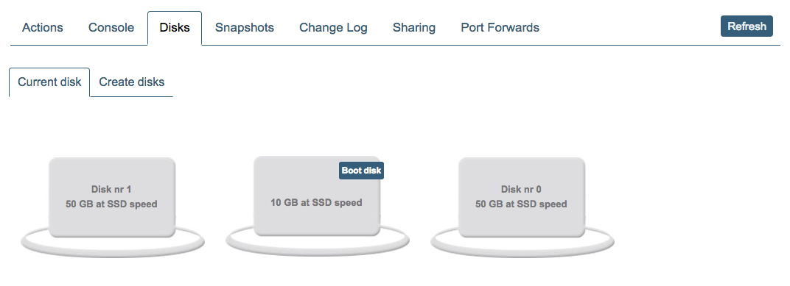

## Snapshots

Creating snapshots is easy, simply click **Take Snapshot** on the **Snapshots** tab.

Below a screenshot after having created two snapshots:

You can roll back to any of your snapshots or delete a snapshot by clicking one of the actions next to your snapshots.

## Change Log

An history of the changes to your virtual machine is shown on the **Change Log** tab:

## Sharing

In the **Sharing** tab you can manage who has access to your virtual machine:

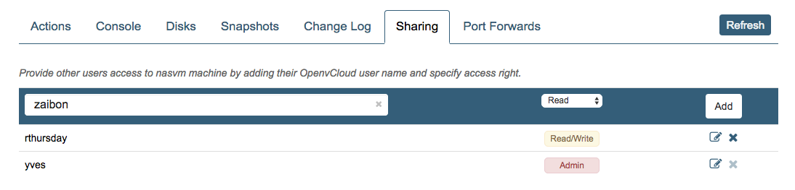

A user can either have Read, Read/Write or Admin privileges.

## Port Forwards

On the **Port Forwards** tab all the Port Forwards for your virtual machine are listed:

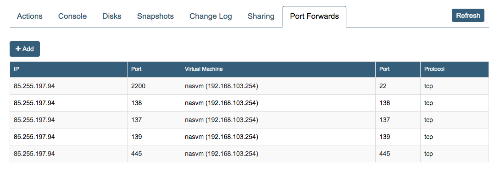

Adding a port forwarding is simple, just click **Add** and specify the source and destination ports:

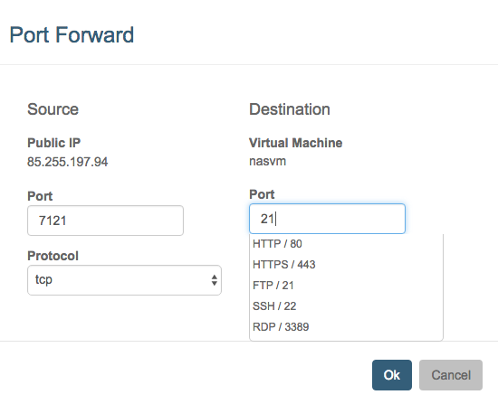

