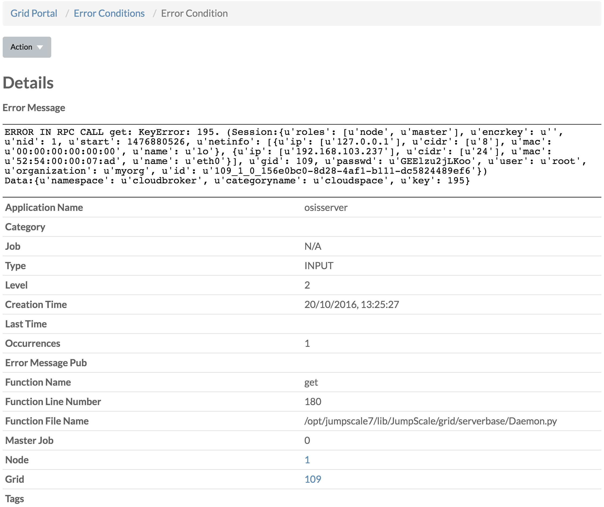
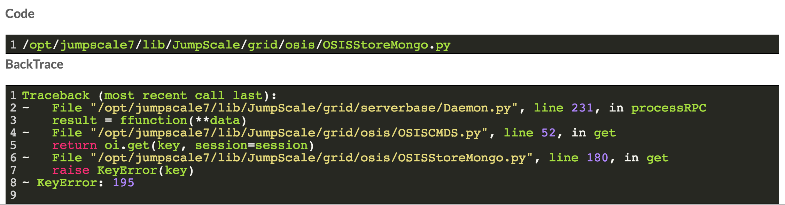

# Error Conditions

On the **Error Conditions** page all the errors are listed:

You can filter on the time stamp, by specifying a date/time range, for instance in the below we filter on everything past October 20th, 11AM:

From the **Actions** dropdown menu you can choose to **Purge** all error conditions.

Clicking the **Time Stamp** brings you to the details of the selected error condition:

 

From the **Actions** dropdown menu you can choose to **Delete** the error condition.

