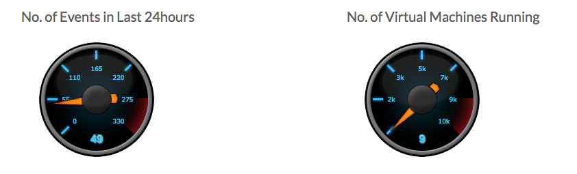

# Home

On the home page of the **Grid Portal** there are two gauges, reporting about the number of events that occurred during the last 12 hours and the number of virtual machines running:

The home pages also has links to:

* [Grid Nodes](gridnodes.md)
* [Jobs](jobs.md)
* [Status Overview](statusoverview.md)

