# Status Overview

## Status Overview

The health of the system is monitored using a collection of JumpScripts, documented in [Monitoring the System Health](../monitoring/health.md).

On the **Status Overview** page you get an immediate view on the health of the system.

You can access the **Status Overview** page in two ways:

* By clicking the green/orange/red status dot in the top navigation bar:

  

* or via the left navigation bar, under **Grid Portal** click **Status Overview**

Under the **Process Status** you get an overview of the health based on the last health check.


By clicking **Run Health Check** a new health check gets scheduled to start immediately.

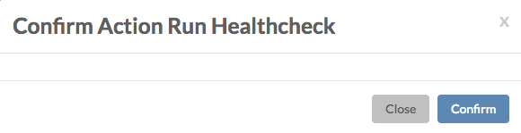

Clicking any of the **Details** links brings you to the **Node Status** page, providing detailed health information for the selected node:

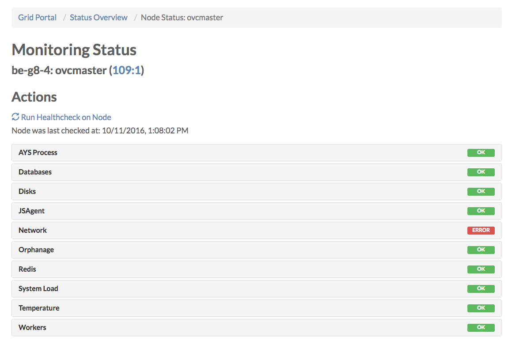

Clicking **Run Health Check on Node** will first ask you for your confirmation:

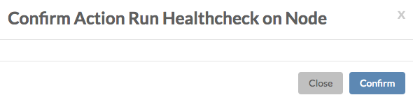

Once confirmed all health check jobs \(JumpScripts\) will start, as you can verify on the **Jobs** page:

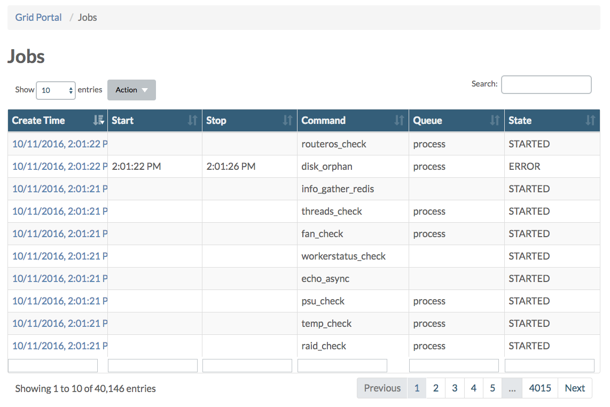

On the **Node Status** page you can see more details by clicking the various section titles. You also have the option here to start the health check related to any of them items listed under each of the sections.

Depending on the type of node, following sections are available:

| Section | Master Node | CPU Node | Storage Node |
| :--- | :---: | :---: | :---: |
| [AYS Process](statusoverview.md#ays-process) | X | X | X |
| [Databases](statusoverview.md#databases) | X |  |  |
| [Disks](statusoverview.md#disks) | X | X | X |
| [JSAgent](statusoverview.md#jsagent) | X | X | X |
| [Network](statusoverview.md#network) | X |  |  |
| [Orphanage](statusoverview.md#orphanage) | X | X |  |
| [Redis](statusoverview.md#redis) | X | X | X |
| [System Load](statusoverview.md#system-load) | X | X | X |
| [Temperature](statusoverview.md#temperature) | X | X | X |
| [Workers](statusoverview.md#workers) | X | X | X |
| [Hardware](statusoverview.md#hardware) |  | X | X |
| [Stack Status](statusoverview.md#stack) |  | X |  |
| [Deployment Test](statusoverview.md#deployment) |  | X |  |
| [OVS Services](statusoverview.md#ovs-services) |  |  | X |

### AYS Process <a id="ays-process"></a>

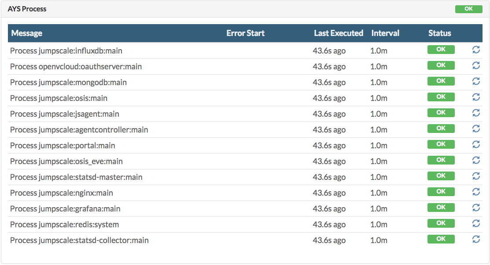

### Databases <a id="databases"></a>

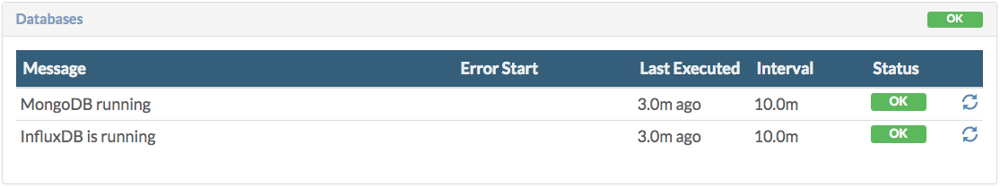

## Disks <a id="disks"></a>


### JSAgent <a id="jsagent"></a>

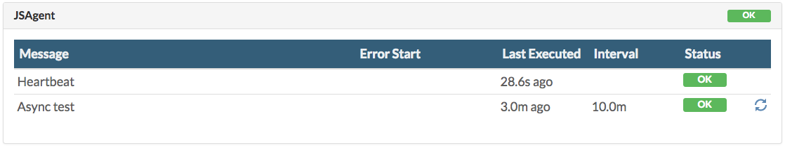

### Network <a id="network"></a>

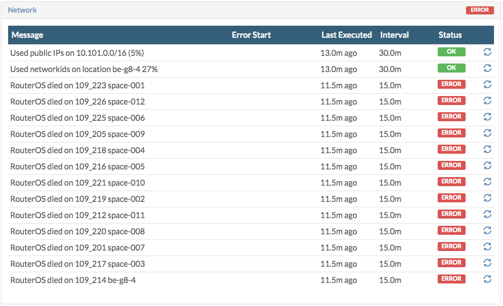

### Orphanage <a id="orphanage"></a>

Depending on the node, you will see information about "orphan" disks or "orphan" virtual machines.

In case of the master node, this look like this: 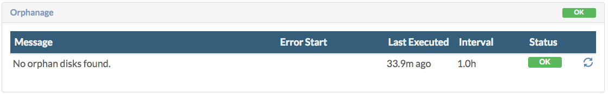

In case of a CPU node you will get an overview of all "orphan" virtual machines. This is about virtual machines that are marked as destroyed in the Grid and Cloud Broker Portal, while they still exist in reality on a physical node. This is obviously unwanted, and as part of automatic health checks, "orphan" virtual machines will get removed.

In order to manually remove "orphan" virtual machines use the following commands at the command line of the physical machine where the "orphan" virtual machine exists:

```text
vm="vm-8"
disks="$(virsh dumpxml $vm | grep 'source file' | cut -d "'" -f 2)"
virsh destroy $vm; virsh undefine $vm
rm $disks
rm -rf /mnt/vmstor/$vm
```

### Redis <a id="redis"></a>

![\[\]](../../.gitbook/assets/redis.png)

### System Load <a id="system-load"></a>

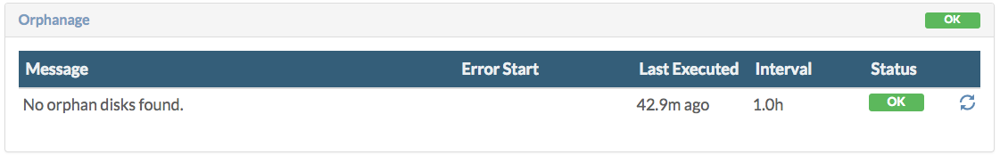

### Temperature <a id="temperature"></a>

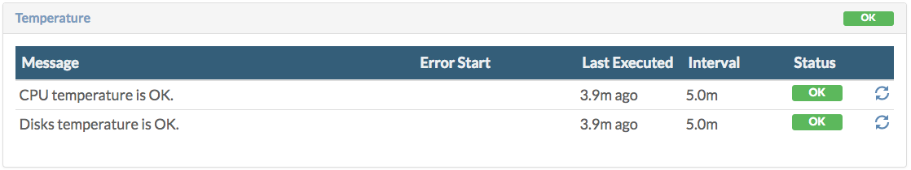

### Workers <a id="workers"></a>

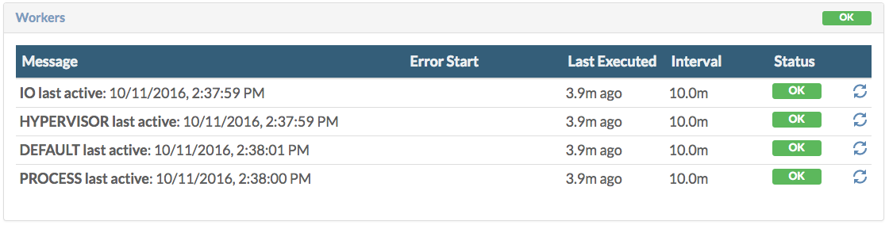

### Hardware <a id="hardware"></a>

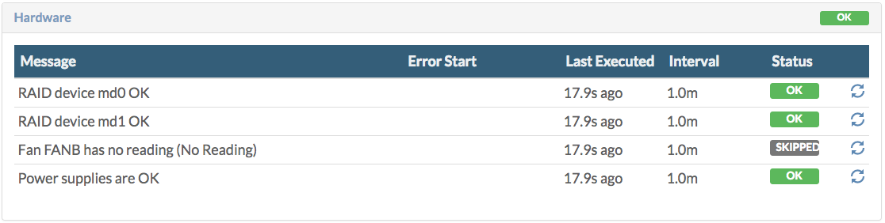

### Node Status <a id="node"></a>

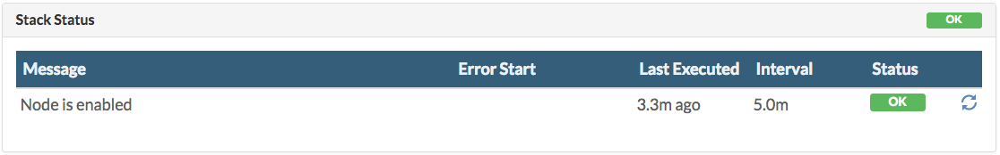

### Deployment Test <a id="deployment"></a>

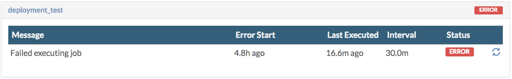

### OVS Services <a id="ovs-services"></a>

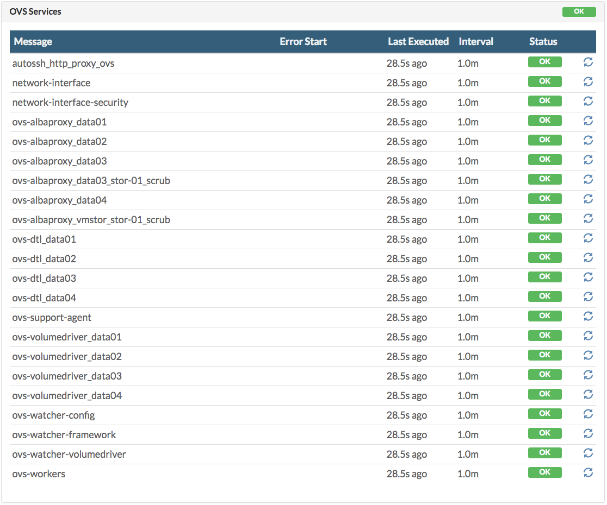

