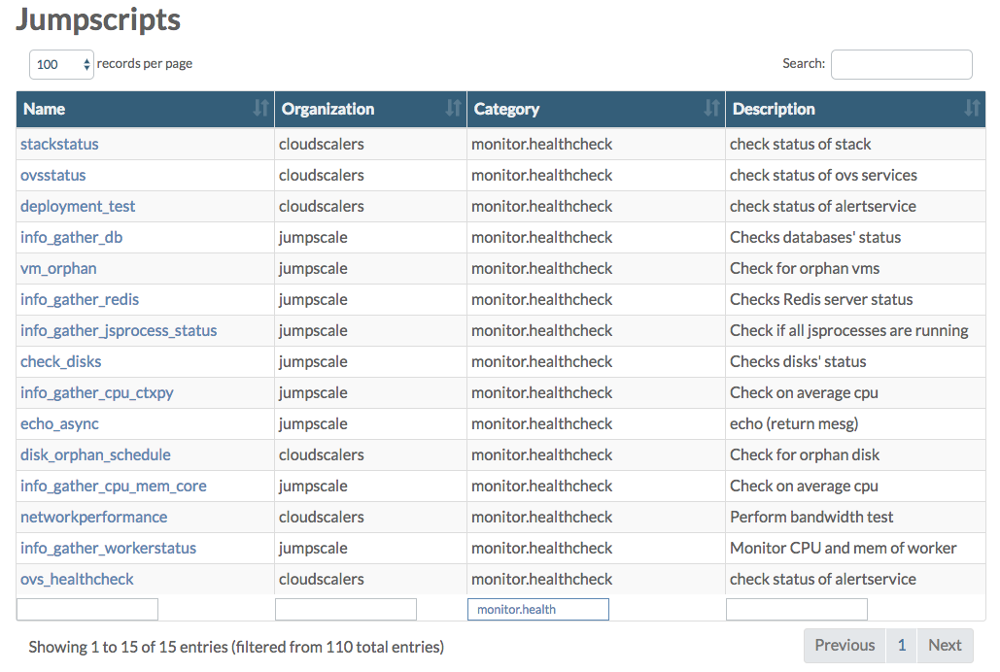

# System Health

Below is just a snapshot in time of the monitoring jumpscripts.

Also check the **JumpScript** page in the **Grid Portal** where you can filter on **monitor.health** to see a list of the JumpScripts actually available on your environment:

In order to check the actual system health go to the **Status Overview** page in the **Grid Portal**, also reachable by clicking the green, orange or red colored bullet in the top navigation bar:

For more information about the **Status Overview** page go to the dedicated section [here](../gridportal/statusoverview.md).

In what follows you get overview of all JumpScripts, organized in the same way \(sections\) as on the **Node Status** page.

Depending on the type of node, following sections are available:

| Section | Master Node | CPU Node | Storage Node |
| :--- | :---: | :---: | :---: |
| [AYS Process](health.md#ays-process) | X | X | X |
| [Databases](health.md#databases) | X |  |  |
| [Disks](health.md#disks) | X | X | X |
| [JSAgent](health.md#jsagent) | X | X | X |
| [Network](health.md#network) | X |  |  |
| [Orphanage](health.md#orphanage) | X | X |  |
| [Redis](health.md#redis) | X | X | X |
| [System Load](health.md#system-load) | X | X | X |
| [Temperature](health.md#temperature) | X | X | X |
| [Workers](health.md#workers) | X | X | X |
| [Hardware](health.md#hardware) |  | X | X |
| [Node Status](health.md#node) |  | X | X |
| [Deployment Test](health.md#deployment) |  | X |  |
| [OVS Services](health.md#ovs-services) |  |  | X |

## AYS Process 

* **ays\_process\_check.py** checks if all AYS processes are running. Throws an error condition for each process that is not running

## System Load 

* **cpu\_ctxpy\_check.py** checks the number of CPU context switches per second. If higher than expected an error condition is thrown
* **cpu\_interrupts\_check.py** checks the number of interrupts per second. If higher than expected an error condition is thrown
* **cpu\_mem\_core\_check.py** checks memory and CPU usage/load. If average per hour is higher than expected an error condition is thrown
* **openfd\_check.py** checks the number of open file descriptors for each process
* **swap\_used\_check.py** checks the amount of swap used by the system
* **threads\_check.py** checks the number of threads, and throw an error if higher than expected

## Databases 

* **db\_check.py** checks status of MongoDB and InfluxDB databases on Master. If not running an error condition is thrown.

## Orphanage 

* **disk\_orphan.py** checks for orphan disks on volume driver nodes. Generates warning if orphan disks exist on the specified volumes. Is scheduled by **disk\_orphan\_schedule.py**, running on the master. Throws an error condition for each orphan disk found
* **vm\_orphan.py** checks if libvirt still has VMs that are not known by the system

## Disks 

* **disk\_usage\_check.py** checks status of all physical disks and partitions on all nodes, reporting back the free disk space on mount points. Throws error condition for each disk that is almost \(&gt;90%\) full

## Hardware 

* **fan\_check.py** checks the fans of a node using IPMItool
* **networkbond\_check.py** monitors if a network bond \(if there is one\) has both \(or more\) interfaces properly active
* **psu\_check.py** checks the power redundancy of a node using IPMItool
* **raid\_check.py** checks whether all configured RAID devices are still healthy

## Bandwidth Test 

* **networkperformance.py** tests bandwidth between storage nodes, volume drivers and itself

## OpenvStorage 

* **ovs\_healthcheck.py** calls the standard Open vStorage health checks, see: [https://github.com/openvstorage/openvstorage-health-check](https://github.com/openvstorage/openvstorage-health-check)

## OVS Services 

* **ovsstatus.py** checks every predefined period \(default 60 seconds\) if all OVS processes are still run

## Deployment Test 

* **deployment\_test.py** tests every predefined period \(default 30 minutes\) whether test VM exists and if exists it tests write speed. Every 24hrs, test VM is recreated

## Network 

* **publicipswatcher.py** checks the status of the available public IPs
* **routeros\_check.py** checks the status of RouterOS. If RouterOS was shut down unexpectedly it will be restarted. \(scheduled by **routeros\_check\_schedule.py**\)

## Redis 

* **redis\_usage\_check.py** checks Redis server status

## Stack Status 

* **nodestatus.py** checks the status of each stack \(CPU node\)

## Temperature 

* **temp\_check.py** checks the CPU + disk temperature of the system

## Workers 

* **workerstatus\_check.py** monitors the workers, checking if they report back on regular basis report to their agent for new tasks

