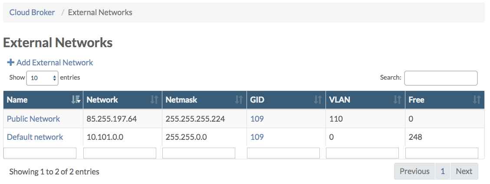
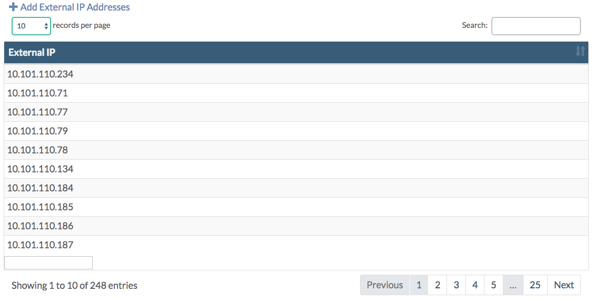

# External Network Addresses

In the **Cloud Broker Portal** on the **External Networks** page you get an overview of the number of available \("free"\) IP addresses per external network:

From there you can click through to the **External Network Details** page:

Under the section **Free IPs** all free IP addresses are listed:

Next all **cloud spaces** are listed that use one of the external network IP addresses :

Also all **virtual machines** are listed that are directly connected to one of the external network IP addresses.

See [External Networks](../cloudbrokerportal/externalnetworks.md) for more details.

