# Statistics

OpenvCloud integrates with [Grafana](http://grafana.org/) for data visualization, and uses [InfluxDB](http://docs.grafana.org/datasources/influxdb/) for storing all aggregated data gathered through **Redis** from various sources. See [How statistics are gathered](monitoring/statistics.md) for more details.

Actual visualization is done via **Grafana Dashboards** which are available in the **Operator Portal** under **Statistics**:

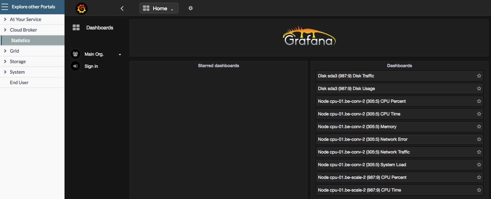

## Overall System Performance

The **Cloud Broker Operator Portal** comes out of the box with the **Overall System Performance** dashboard consisting of following panels:

* [Total IOPS](statistics.md#total-iops)
* [CPU Utilization](statistics.md#cpu-utilization)
* [CPU Percentage](statistics.md#cpu-percentage)
* [Available Memory](statistics.md#available-memory)
* [Receive/Transmit \(Rx/Tx\)](statistics.md#rx-tx)
* [Context Switches](statistics.md#context-switches)

### Total IOPS 

This panel show the total READ and WRITE IOPS of all virtual disks combined.

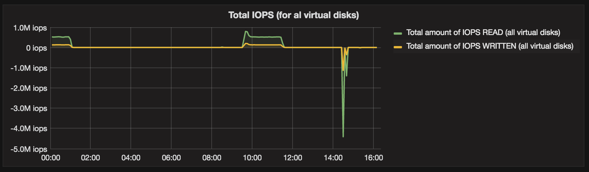

* Panel type: Graph
* Panel data source: influxdb\_controller
* Metrics:
  * Query A, Total amount of IOPS READ:
    * FROM **disk.iops.read\|m** WHERE type = virtual
    * SELECT field\(value\) sum\(\)
    * GROUP BY time\(auto\)
  * Query B, Total amount of IOPS WRITE:
    * FROM **disk.iops.write\|m** WHERE type = virtual
    * SELECT field\(value\) sum\(\)
    * GROUP BY time\(auto\)

### CPU Utilization 

The first panel shows the average, minimum and maximum CPU time for all physical nodes:

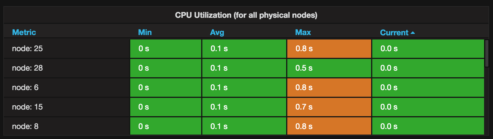

* Panel type: Graph
* Panel data source: influxdb\_controller
* Metrics:
  * Queries A, Average CPU utilization \(all physical nodes\):
    * FROM default **machine.CPU.utilization\|m** WHERE type = physical
    * SELECT field\(value\) **mean\(\)**
  * Queries B, Minimum CPU utilization \(all physical nodes\):
    * FROM default **machine.CPU.utilization\|m** WHERE type = physical
    * SELECT field\(value\) **min\(\)**
  * Queries C, Maximum CPU utilization \(all physical nodes\):
    * FROM default **machine.CPU.utilization\|m** WHERE type = physical
    * SELECT field\(value\) **max\(\)**

The second panel shows the minimum, average, maximum and current CPU time for each physical node:

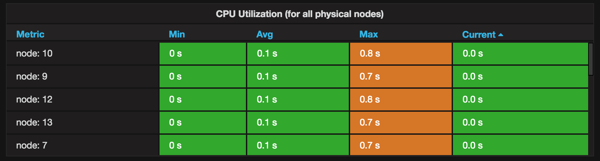

* Panel type: Table
* Panel data source: influxdb\_controller
* Metrics:
  * Query A:
    * FROM **machine.CPU.utilization\|m** WHERE type = physical
    * SELECT field\(value\)
    * GROUP BY tag\(nid\)
    * ALIAS BY: node: $tag\_nid
* Options:
  * To Table Transform: **Time series to aggregations**
  * Columns: Min, Avg, Max, Current

### CPU Percentage 

The first panel shows the average, minimum and maximum CPU percentage for all physical nodes:

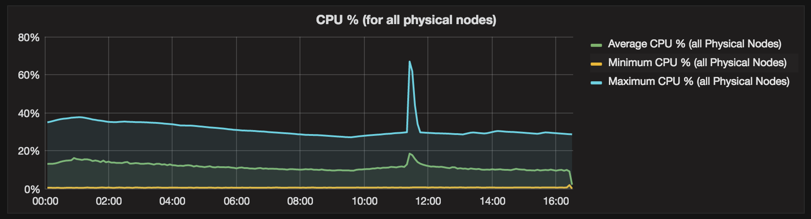

The second panel shows the minimum, average, maximum and current CPU percentage for each physical node:

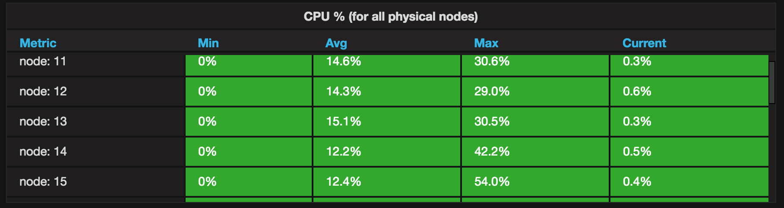

### Available Memory 

The first panel shows the average, minimum and maximum amount of available memory for all physical nodes:

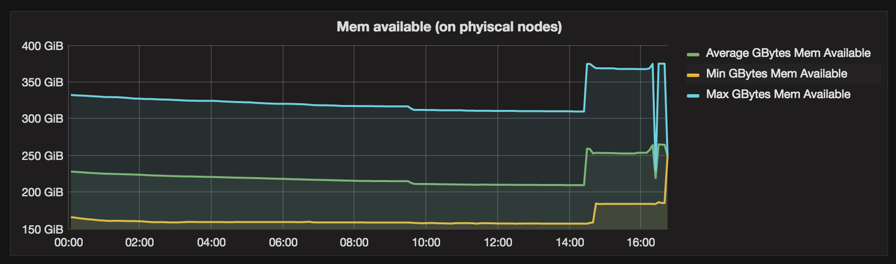

The second panel shows the minimum, average, maximum and current amount of available memory of each physical node: 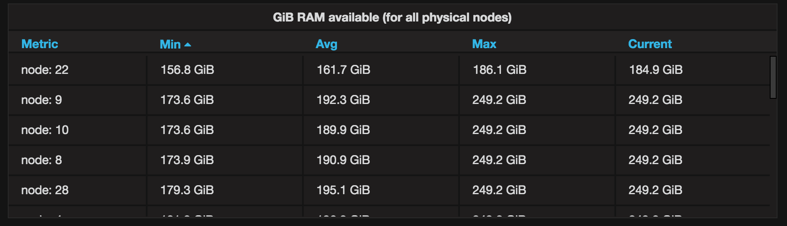

### Receive/Transmit \(Rx/Tx\) 

The first panel shows the average, minimum and maximum amount of received data for all physical nodes, and the details per physical node:

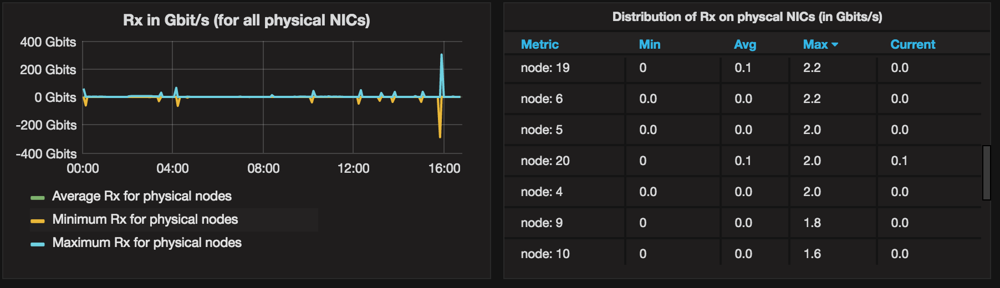

The second panel shows shows the average, minimum and maximum amount of transmitted data for all physical nodes, and the details per physical node:

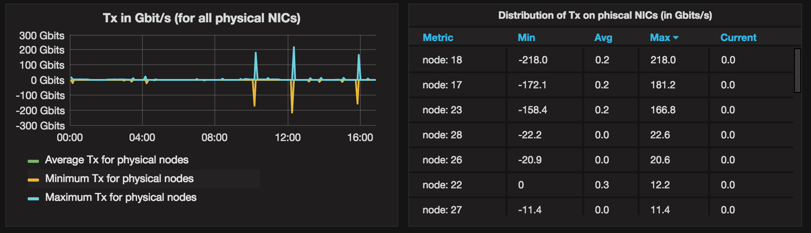

### Context Switches 

The first panel shows the average, minimum and maximum amount of context switches for all physical nodes:

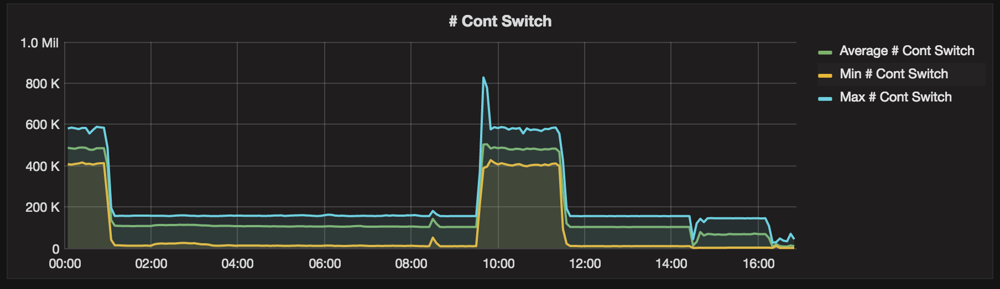

The second panel shows the minimum, average, maximum and current amount of context switches of each physical node:

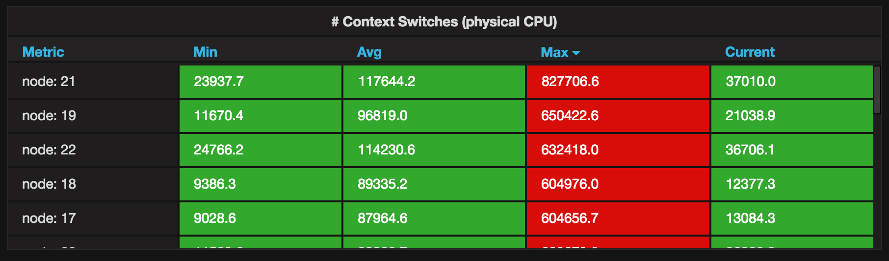

