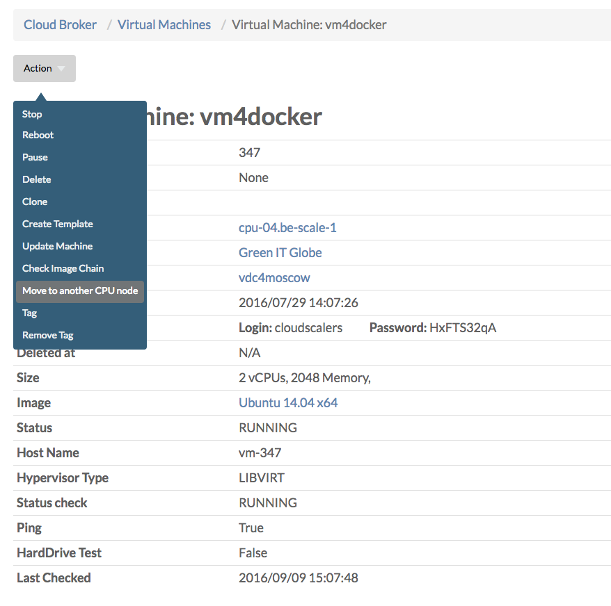
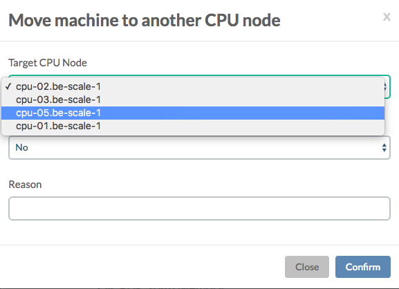
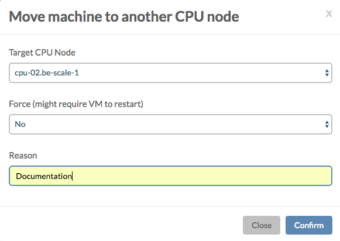
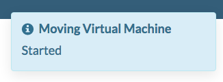
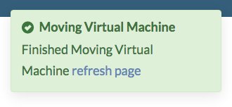

# Moving Virtual Machines to Another CPU Node

In order to move a virtual machine manually you need access to the **Cloud Broker Portal**, where you can select the virtual machine you want to move from the **Virtual Machines** page:

On the **Virtual Machine Details** page select **Move to another CPU node** from the **Action** menu:

Select the targeted CPU node:

Specify a reason for the move:

After hitting **Confirm** first a notification will appear start the **move started**:

Once the move is done you'll get another message notifying the **move finished** and inviting you to **refresh** the page:

